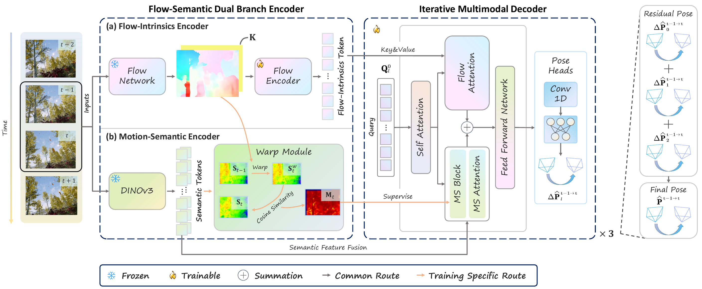

<h1 align="center">MVOFormer: Flow-Semantic Transformer for Robust Monocular Visual Odometry</h1>

<p align="center">
  <strong>Accepted by IEEE Robotics and Automation Letters (RA-L)</strong>
</p>

<p align="center">
  Jituo Li, <a href="https://sun-shun.github.io/">Shunwang Sun</a>, Jialu Zhang, <a href="https://www.liuxinqi.cn/">Xinqi Liu</a>, Jinyao Hu, Zhicheng Lu, <a href="https://sajad-saeedi.ca/">Sajad Saeedi</a>, Guodong Lu
</p>

<p align="center">
  <a href="https://github.com/Sun-Shun/MVOFormer">
    
  </a>
  <a href="https://arxiv.org/abs/2606.16474">
    
  </a>
</p>

<p align="center">
  
</p>


---

## Abstract

In this work, we propose **MVOFormer**, a novel transformer framework for robust monocular visual odometry. Our architecture features a **Flow-Semantic Dual Branch Encoder** that synergizes dense geometric motion cues with object-centric semantic priors, explicitly distinguishing static structures from dynamic distractors. These representations are then fused by an **Iterative Multimodal Decoder**, enabling coarse-to-fine pose refinement while dynamically suppressing attention on unreliable regions.

<p align="center">
  
  <br>
  <a href="assets/MVOFormer.mp4">⬇ Download Video (MP4)</a>
  <br>
  <em>Demo data from <a href="https://moyangli00.github.io/droid-w/">DROID-W</a></em>
</p>

---

## Installation

```bash
# Create conda environment
conda create -n mvoformer python=3.11 -y
conda activate mvoformer

# Install PyTorch (CUDA 12.x)
pip install torch torchvision --index-url https://download.pytorch.org/whl/cu121

# Install dependencies
pip install -r requirements.txt
```

The Deformable Attention CUDA ops are pre-compiled for Python 3.11. If you encounter import errors, recompile:

```bash
cd Network/Deformable_ops
bash make.sh
cd ../..
```

---

## Repository Structure

```
MVOFormer/
├── assets/                    # Demo video and paper PDF
│   ├── MVOFormer.mp4
│   └── MVOFormer.pdf
├── Configs/
│   └── MVOFormer.yaml         # Main configuration file
├── Model/                     # Pretrained model checkpoints
│   ├── stage_1_model.pth      # Flow-only pretrained (200 epochs)
│   └── MVOFormer.pth          # Final model (50 epochs)
├── Network/
│   ├── Deformable_ops/        # Deformable attention CUDA ops
│   ├── Model/                 # MVOFormer model (transformer, backbone, etc.)
│   ├── SeaRAFT/               # SeaRAFT optical flow model
│   └── dinov3/                # DINOv3 visual-semantic backbone
├── Tool/
│   ├── Datasets/              # Dataset loading & augmentation
│   ├── Evaluator/             # Trajectory evaluation (ATE, RPE, KITTI)
│   ├── Train_Test/            # Trainer, Tester, and Inference modules
│   └── Utils/                 # Utilities (logging, seeding, transforms)
├── Outputs/                   # Checkpoints and logs (gitignored)
├── train.py                   # Training & evaluation script
├── infer.py                   # Inference script (no GT poses needed)
├── requirements.txt
└── LICENSE
```

---

## Dataset Preparation

The code supports **[TartanAir](https://theairlab.org/tartanair-dataset/)**, **[TartanAir-Shibuya](https://github.com/haleqiu/tartanair-shibuya)**, **KITTI**, **TUM-RGBD**, **Bonn**, **EuRoC**, and **ETH3D-SLAM** datasets.

Each dataset should be organized as:

```
dataset/
  {split}_img/        # RGB images
  {split}_flow_sea/   # Pre-computed optical flow (.npy)
  {split}_pose/       # Ground-truth poses (.txt, 7-DoF: xyz + quaternion)
```

Optical flow can be pre-computed using [SEA-RAFT](https://github.com/princeton-vl/SEA-RAFT). Update `Configs/MVOFormer.yaml` with your dataset paths.

### Pretrained Model Weights

| Model | Source | Placement |
|-------|--------|-----------|
| DINOv3 backbone | [facebookresearch/dinov3](https://github.com/facebookresearch/dinov3) | `Network/dinov3/weights/` |
| SEA-RAFT optical flow | [princeton-vl/SEA-RAFT](https://github.com/princeton-vl/SEA-RAFT) | `Network/SeaRAFT/models/` |
| Stage 1 (flow-only) | [Google Drive](https://drive.google.com/drive/folders/1WHO0vYpWjK_n0-LU33qb5kUphER06UzI?usp=drive_link) | `Model/stage_1_model.pth` |
| MVOFormer (full) | [Google Drive](https://drive.google.com/drive/folders/1WHO0vYpWjK_n0-LU33qb5kUphER06UzI?usp=drive_link) | `Model/MVOFormer.pth` |

---

## Training Pipeline

### Stage 1: Flow-Only Pretraining

The first stage trains MVOFormer using **ground-truth optical flow only** (without semantic features) for 200 epochs. This stage learns basic motion understanding.

```bash
CUDA_VISIBLE_DEVICES=0 python train.py --mode train \
  --set model.is_Semantics=False \
  --set trainer.max_epoch=200 \
  --set trainer.pretrain_model=None
```

After training, rename the output checkpoint to `Model/stage_1_model.pth`.

### Stage 2: Full Training with Semantics

The second stage loads the flow-only checkpoint and adds DINOv3 semantic features, training for 50 epochs. The optical flow used in this stage is **pre-computed by SEA-RAFT** and saved locally (under `{split}_flow_sea/`), rather than ground-truth flow.

```bash
CUDA_VISIBLE_DEVICES=0 python train.py --mode train \
  --set model.is_Semantics=True \
  --set trainer.pretrain_model=./Model/stage_1_model.pth \
  --set trainer.max_epoch=50
```

### Training Details

| Component | Description |
|-----------|-------------|
| **Model** | MVOFormer with DINOv3 backbone (81.98M params, 52.53M trainable) |
| **Optimizer** | AdamW (lr=5e-5, weight_decay=1e-4) |
| **LR Schedule** | Cosine decay with 3-epoch linear warmup (init_lr=1e-5, min_lr=1e-7) |
| **Batch Size** | 64 |
| **Mixed Precision** | BF16 (automatic if GPU supports it) |
| **Gradient Clipping** | max_norm=1.0 |
| **Loss** | Weighted translation + rotation regression with uncertainty learning |
| **Augmentation** | Spatial random crop (scale up to 2.5×), color jitter (brightness/contrast/saturation) |
| **Datasets** | TartanAir (305K samples) + TartanAir-Shibuya (×10 repeat) |

### Checkpoints

During training, the model saves:
- `checkpoint_epoch_{N}.pth` — every `save_frequency` epochs (default: 5)
- `checkpoint_best.pth` — epoch with lowest validation loss
- `checkpoint_final.pth` — latest epoch

---

## Evaluation Pipeline

### Evaluation with Ground-Truth Poses

Evaluate a specific checkpoint on test datasets:

```bash
CUDA_VISIBLE_DEVICES=0 python train.py --mode eval --config Configs/MVOFormer.yaml --checkpoint 50
```

Uses checkpoint at `Outputs/{model_name}/checkpoint_epoch_{N}.pth`.

The evaluation:
1. Loads the specified checkpoint (`checkpoint_epoch_50.pth` in `Outputs/{model_name}/`, e.g. `Outputs/MVOFormer/checkpoint_epoch_50.pth`).
2. Iterates over all test sequences defined in `cfg['dataset']['test_datasets']`.
3. For each sequence, runs the model frame-by-frame, computes relative poses.
4. Evaluates trajectory using **ATE** (Absolute Trajectory Error), **scale**.
5. Saves trajectory plots as `.png` and estimated poses as `.txt` in `Outputs/results/`.
6. Reports mean ATE per dataset and overall average.

### Multi-Checkpoint Sweep

```bash
# Set tester.mode: all in config to sweep all checkpoints
```

---

## Inference Pipeline (No Ground-Truth Poses)

For inference on new data without ground-truth poses:

```bash
python infer.py --config Configs/MVOFormer.yaml --checkpoint ./Model/MVOFormer.pth --mode single
```

Other options:
- `--checkpoint_epoch 50` — use `Outputs/{model_name}/checkpoint_epoch_50.pth` instead of `--checkpoint`
- `--mode all` — sweep all `checkpoint_epoch_*.pth` in `Outputs/{model_name}/`

The inference pipeline:
1. Builds model and loads checkpoint.
2. Warms up GPU with a dummy forward pass.
3. For each sequence, resets the DINOv3 RNN state, runs inference with CUDA timing.
4. Converts relative motions to absolute trajectory.
5. Plots and saves trajectory as `.png` and estimated poses as `.txt` in `Outputs/results/`.
6. Reports per-frame average inference time and FPS.

---

## Configuration Reference

Key parameters in `Configs/MVOFormer.yaml`:

| Parameter | Default | Description |
|-----------|---------|-------------|
| `model.DINOv3_version` | `smallplus` | DINOv3 backbone variant |
| `model.num_queries` | `100` | Number of transformer queries |
| `model.enc_layers` | `3` | Encoder layers |
| `model.dec_layers` | `3` | Decoder layers |
| `model.is_Semantics` | `True` | Enable DINOv3 semantic features |
| `model.with_pose_refine` | `False` | Enable pose refinement branch |
| `dataset.batch_size` | `64` | Training batch size |
| `trainer.max_epoch` | `50` | Total training epochs |
| `trainer.amp_dtype` | `bf16` | Mixed precision (bf16/fp16/fp32) |
| `trainer.pretrain_model` | `./Model/stage_1_model.pth` | Flow-only pretrained weights |
| `trainer.save_frequency` | `5` | Save checkpoint every N epochs |
| `optimizer.lr` | `0.00005` | Learning rate |
| `inference.mode` | `single` | Inference mode (single/all) |
| `inference.datasets` | — | Datasets for inference (same format as test_datasets) |

### Supported Dataset Types

| Type | Intrinsics (fx, fy, cx, cy) |
|------|-----------------------------|
| `tartanair` | 320.0, 320.0, 320.0, 240.0 |
| `tartanair_shibuya` | 772.55, 772.55, 320.0, 180.0 |
| `kitti` | 707.09, 707.09, 601.89, 183.11 |
| `euroc` | 458.65, 457.30, 367.22, 248.38 |
| `tum` | 517.3, 516.5, 318.6, 255.3 |
| `bonn` | 517.3, 516.5, 318.6, 255.3 |
| `ETH3D` | 726.21, 726.21, 359.20, 202.47 |

---

## Citation

```bibtex
@article{mvoformer2026,
  title={MVOFormer: Flow-Semantic Transformer for Robust Monocular Visual Odometry},
  author={Sun, Shun and others},
  journal={IEEE Robotics and Automation Letters},
  year={2026}
}
```

---

## License

This project is licensed under the **BSD 3-Clause License** — see the [LICENSE](LICENSE) file for details.

Copyright (c) 2026, Zhejiang University
